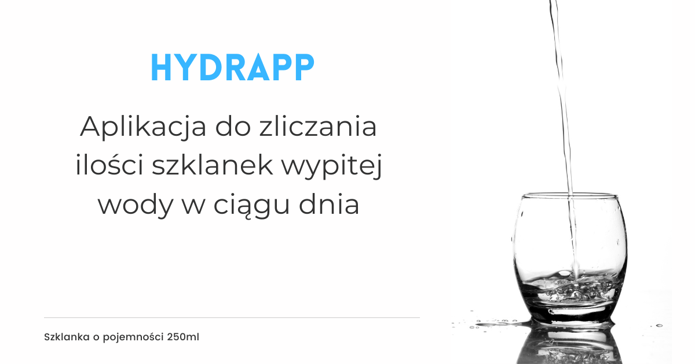

# Hydrapp

Aplikacja służy do zliczania ilości szklanek wypitej wody w ciągu dnia.

## Zasada działania aplikacji

Jedno kliknięcie w przycisk "dodaj szklankę" oznacza wypicie 1 szklanki wody. 
Gdy się pomylimy lub nie wypijemy szklanki wody, mamy możliwość cofnięcia poprzez naciśnięcie przycisku "usuń szklankę".

*zalecane jest wypicie od 1,5 - 2 L wody dziennie.
*szklanka jest o pojemności 250ml .
